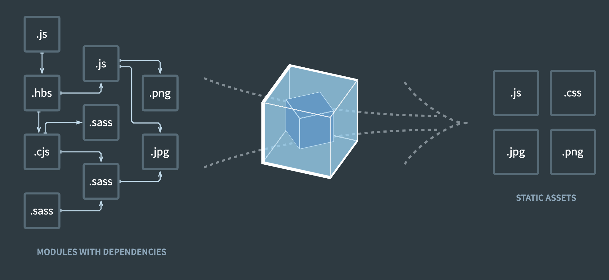
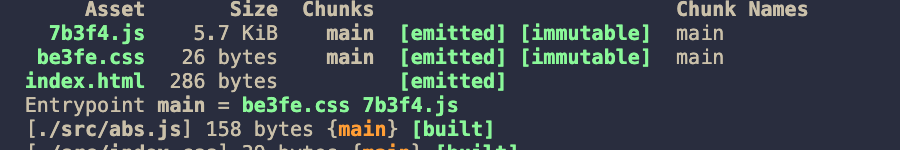
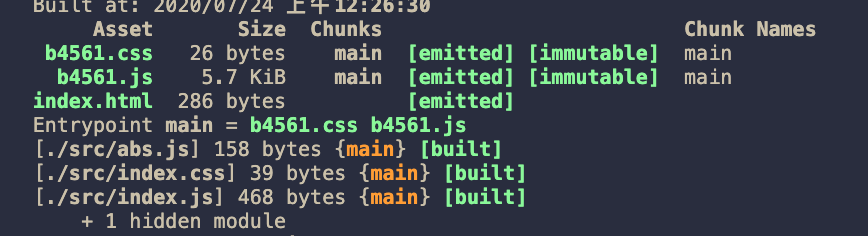

在webpack配置中输出的配置中，提供了几个占位符号，其中contenthash与chunkhash是令人比较费解的两个。

<!-- more -->

## bundle, module, chunk

### module

module 是最好理解的，我们通常会把webpack 描述为 **module bundler**。在webpack中，一切资源都是模块，其实webpack本身智能处理js module，但是通过loader，可以处理不同类型的module，比较常见的比如css，图片，字体。



可以看到左边这个就是不同类型的module。

在webpack官网针对module 还有专门的介绍，简而言之，通过各种语法对各种资源的引用让webpack能够建立起一个依赖树。比如

- ES2015 import
- CommonJS `require()`语法
- AMD `define` , `require`语法
- css/less/scss 中的 `@import`
- css 中的` url(...)`
- html中`img src=... >`

通过loader，可以支持非常多的module类型，比如使用ts-loader就可以支持ts module。回想一下，webpack 配置loader就是在module对象下配置的。

### bundle

bundle 对应的是最终生成的文件，一个文件对应一个bundle

### chunk

chunk是webpack 中一个不好理解，但是又非常重要的概念。是webpack 内部处理的的一个表示，chunk是module 的集合。

在[Concepts- Bundle vs Chunk](https://github.com/webpack/webpack.js.org/issues/970#issuecomment-305525560)的讨论中，webpack的贡献者提出了下面的观点：

chunk就是 bundle，chunk只是对依赖的一层封装。还提出了三种chunk

- entry chunk：entry chunk就是应用的入口，里面包含了webpack的启动代码，整体而言就是一个IIFE，参数是modules，就是一个一个的module。entry chunk一定是最先执行的。
- initial chunk：initial chunk 是同步加载的，但是不包含webpack的那些启动代码。initial chunk 一般是紧跟在 entry chunk之后加载的。initial chunk 也是一个bundle（用户侧的称呼），initial chunk 一般可以由拆包生成，比如SplitChunksPlugin, 或者 mini-css-extract-plugin。典型的代码如下:

```js
webpackJsonp([0],[
/* 0 */
/* unknown exports provided */
/* all exports used */
/*!*********************!*\\
  !*** ./utility2.js ***!
  \\*********************/
/***/ (function(module, exports) {

module.exports = "utility2";

/***/ }),
/* 1 */
/* unknown exports provided */
/* all exports used */
/*!*********************!*\\
  !*** ./utility3.js ***!
  \\*********************/
/***/ (function(module, exports) {

module.exports = "utility3";

/***/ })
]);
```

- Normal chunk: normal chunk 和initial chunk的区别在于，normal chunk是懒加载或者说是异步加载的。比如通过import()动态导入语法就会生成normal chunk。normal chunk。normal chunk 是异步的，没有固定的顺序。

如果按照chunk产出的原因来分的话。大概可以分为3类

- entry
- SplitChunksPlugin
- Dynamic import

在webpack打包结果中会说明每一个文件来自与哪个chunk



## contenthash, chunkhash

官网上对chunkhash 的解释是 The hash of chunk content, 对contenthash的解释是 The hash of the content of a file。

而且还特地标注了，如果使用ExtracTextWebpackPlugin的时候，用contenthash ，不要使用chunkhash。

这是为什么呢？

先搭建一下webpack 环境把。

```jsx
// webpack.config.js
module.exports = {
  entry: './src/index.js',
  mode: 'development',
  output: {
    path: path.resolve(__dirname, '../dist'),
    filename: '[chunkhash:5].js',
  },
  module: {
    rules: [
      {
        test: /\\.js$/,
        use: 'babel-loader'
      },
      {
        test: /\\.css$/,
        use: [MiniCssExtractPlugin.loader, 'css-loader'],
      },
    ]
  },
  plugins: [
    new HtmlWebpackPlugin({
      template: path.resolve(__dirname, '../src/index.html'),
      // chunks: ['vendors', 'runtime', 'main']
    }),
    new CleanWebpackPlugin(),
    new MiniCssExtractPlugin({
      filename: '[contenthash:5].css'
    })
  ]
}
```

源文件如下

```jsx
// index.js
import { abs } from './abs'
import './index.css'

window.onload = () => {
  const div = document.createElement('div')
  div.className = 'food'
  div.textContent = 8888
  document.body.append(div)
}

console.log(abs(109))
// index.css
.food {
  color: yellow;
}
// abs.js
export const abs = (value) => (value > 0 ? val
```

接下来，调整output.filename使用的占位符和MiniCssExtractPlugin使用的占位符。

为了测试这俩占位符的区别，每次只会做以下任意一种修改

- A：修改index.js文件 ，console.log()的值
- B：修改index.css文件内容

1. 如果二者都是用chunkhash

A, B 两种情况都会导致打包出来的文件发生变化，而且，二者文件名都是一样的（前提占位符一样）。



2. 如果二者都是用contenthash

A: js文件发生变化，css文件没有发生变化

B: js文件没有发生变化，css文件发生变化

在这里的场景，由于css都被抽离成一个单独的文件，直接插入到html中，但是如果类似与动态引入的话，比如

```jsx
// index.js
import('./example.js').then(() => {})
```

如果example.js文件了，index.js 文件还不修改的话，必然会导致引用文件失败。因为之前的文件已经不在了。

3. 如果output.filename 是contenthash，css插件用的是chunkhash的话

A: js 文件发生变化，css文件发生变化

B: js 文件不发生变化，css文件发生变化

可以看到，我们只修改了js文件，但是css文件也变了

4. 如果output.filename使用chunkhash, css插件使用contenthash的话

A: js文件发生变化，css文件不发生变化

B: js文件发生变化，css文件发生变化

从缓存的角度来看，我们总是希望尽可能充分利用缓存，每次只变更我们更新过的文件。前提是更新过的文件能够作用。

显然上面第四种是符合要求的，也就是output.filename使用chunkhash, css plugin使用contenthash。

从这我们也可以对比得知contenthash 是只与内容相关，内容变了，hash就变了。而chunkhash是一整个chunk的内容，不仅仅是自己的内容，还有引用的别的module 的内容，任何一个变化了，都要发生变化，这就和chunk 的概念不谋而合了。

参考资料

- [webpack官网](https://webpack.js.org/configuration/output/#outputfilename)
- [stackoverflow: What are module, chunk and bundle in webpack](https://stackoverflow.com/questions/42523436/what-are-module-chunk-and-bundle-in-webpack)
- [github issue: Concepts- Bundle vs Chunk](https://github.com/webpack/webpack.js.org/issues/970)
- [webpack中的bundle, module, chunk分别是什么](https://juejin.im/post/5d70ad50f265da03cf7aae91)
