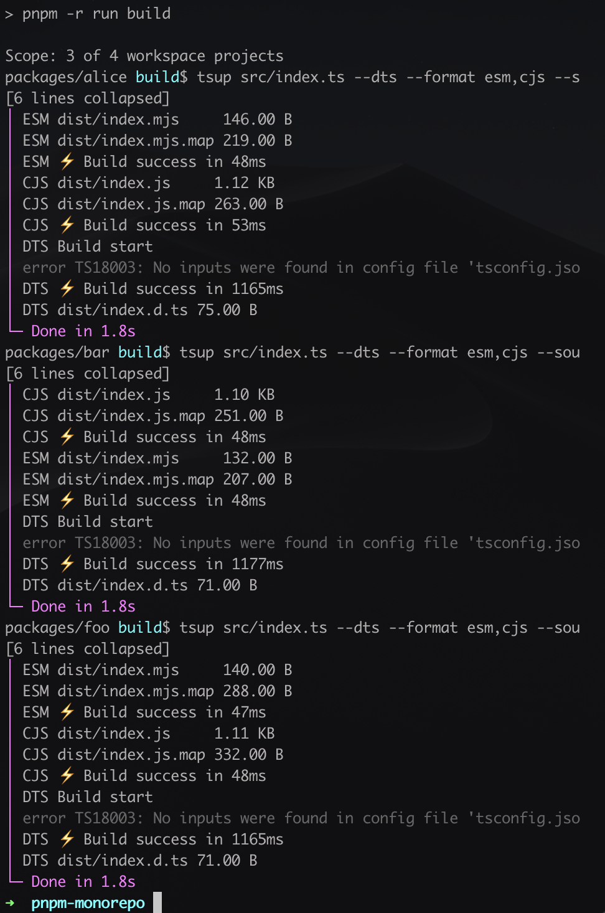
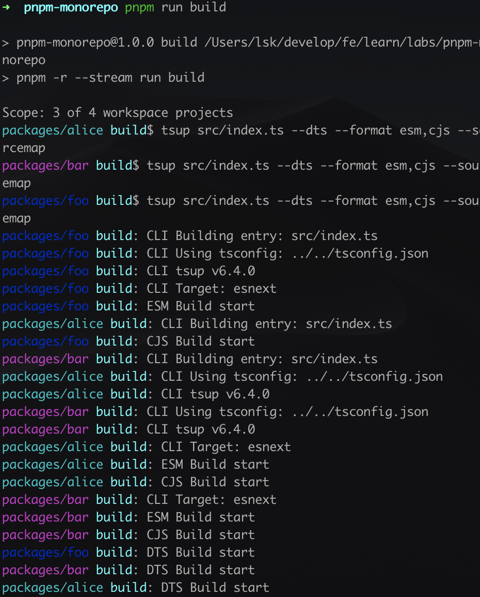
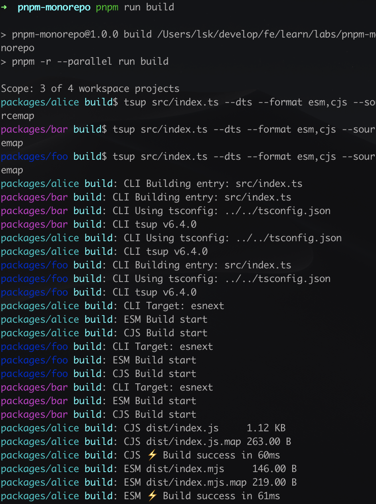
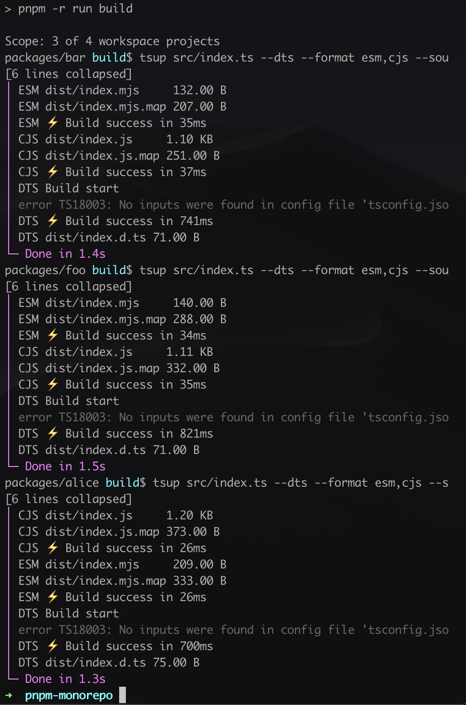
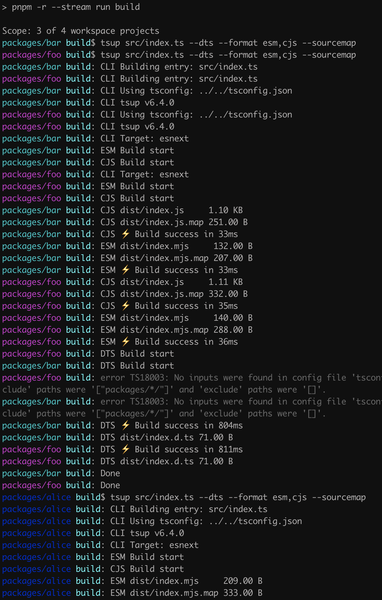
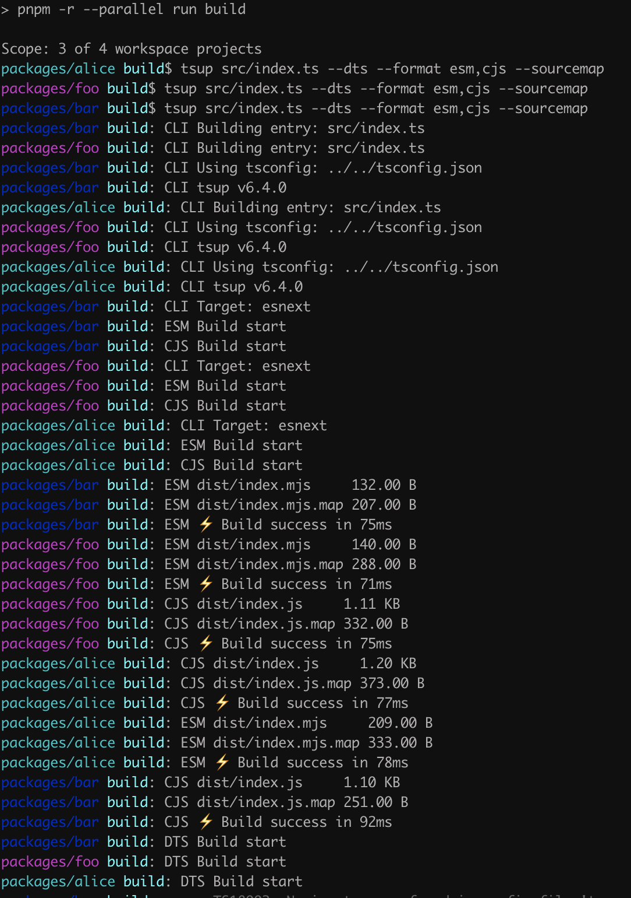
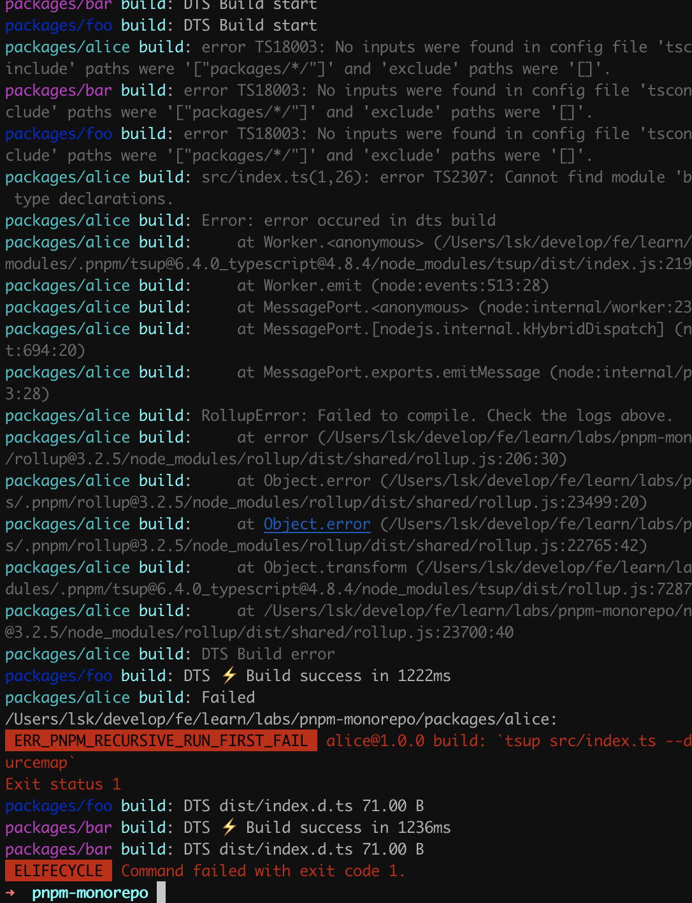

pnpm 作为一款与 `npm`, `yarn` 类似的依赖管理工具，对 monorepo 也提供了非常好的支持，针对使用`yarn` workspace 的问题给出了非常优雅的解决方案。本文将从三个方面对此做简单介绍：

- workspace 语法
- pnpm 的 stream，parallel 参数
- filter 过滤语法

## workspace 语法

不知道读者们有没有使用 `yarn workspace` 的经验；如果有两个子包 foo, bar, 想要将 bar 作为项目依赖加到 foo 中，可能你会在 bash 中执行`yarn workspace foo add bar`。

`yarn` 可能会从远程仓库中拉取 bar 包，这就与我们想要的有点不一样了。不过可以通过指定固定的版本号来让 `yarn` 将本地的 bar 包作为 foo 的依赖

```bash
yarn workspace foo add bar@0.1.2 # 具体的版本号需要看bar包的package.json#version
```

这就给使用者带来了迷惑和不确定性，pnpm 引入了 `workspace` 语法，特指本地包，具体的可以查看 [pnpm workspace](https://pnpm.io/zh/workspaces)。

现在我们通过命令 `pnpm -F foo add bar` 为 foo 添加 bar 为项目依赖，可以看到 foo 的 package.json#dependencies 中

```json
"dependencies": {
  "bar": "workspace:^1.0.0"
}
```

不过需要注意的是 `workspace` 仅仅是 pnpm 支持，因为在 `pnpm run publish` 或者 `pnpm run pack` 的时候，`pnpm` 会自动将 `workspace` 语法 转化为标准的版本号。

比如

```json
{
  "dependencies": {
    "foo": "workspace:*",
    "bar": "workspace:~",
    "qar": "workspace:^",
    "zoo": "workspace:^1.5.0"
  }
}
```

会被转化为

```json
{
  "dependencies": {
    "foo": "1.5.0",
    "bar": "~1.5.0",
    "qar": "^1.5.0",
    "zoo": "^1.5.0"
  }
}
```

## pnpm stream & parallel

我们搭建以下的测试环境

```yaml
- packages
	- foo
	- bar
	- alice
package.json
pnpm-lock.yaml
pnpm-workspace.yaml
```

```yaml
packages:
	- 'packages/*'
```

foo, bar, alice 是三个子包， 每个子包都是用 tsup 进行打包。然后，在根 package.json 中，需要 一个命令对所有子包进行构建

```json
"script": {
	build: "pnpm -r run build"
}
```

这里有一个需要注意的是，一定要加 `-r`

> --recursive -r
> 这会从每一个  `package`的“ scripts”对象中执行任意一个命令。 如果一个  `package`没有该命令，就会被跳过。 如果所有  `package`都没有这个命令，则会执行失败。

如果不加 `-r`的话，会只运行当前 package.json 的 build，其实是没有的，自己运行自己，会进入死循环；


加上 `-r` 之后，当前找不到，就会去 workspace 中找 build 命令。


可以看到是一个包一个包构建的；

现在三个包都是相互独立的，可以运行 `pnpm -r --stream run build`



> --stream
> 以起始`package`目录作为前缀，立即从子进程输出流。 这允许从不同的  `package`交替输出

可以看到三个 包 顺序交替；

再运行一下 `pnpm -r --parallel run build`



> --parallel
> 完全忽略并发和拓扑排序，在所有匹配的包中立即运行给定的脚本 并输出前缀流。 这是个推荐的标志，用于在许多  `packages`上长时间运行的进程，例如冗长的构建进程。

可以看到 如果子包没有依赖关系的话，这个和 stream 效果是一样的

现在我们给子包加上依赖关系，运行 `pnpm -F alice add bar` 让 alice 包依赖 bar 包。再运行 `pnpm -r run build`, 可以看到



可以看到 只加了 `-r` 参数的话，pnpm 会自动分析 依赖拓扑，先构建 bar，而且每个包的输出都有有顺序的。
再 运行 `pnpm -r --stream run build`



可以看到 `--stream` 只是 让不同子包的输入会交错，实际的打包顺序还是严格按照拓扑关系来的，在这里先打包 bar, foo, 再打包 alice。

再运行 `pnpm -r --parallel run build`, 这个偶尔出错，因为有时候 bob 比 alice 包先打包完，则不会报错；否则就会报错。


可以看到 ，如果 alice 比 bar 先打包就会报错


## -F --filter 与 workspace

在 [pnpm 过滤](https://pnpm.io/zh/filtering) 中 有 一部分过滤器 是专门设计给 workspace 使用的。

- `--filter pkg... run test` 会将 pkg 包和 pkg 所有的依赖包进行 测试
- `--filter pkg^... run test` 会运行 所有 pkg 包的依赖项的测试
- `--filter ...pkg run test` 会运行 pkg 包以及依赖它的所有包的测试
- `--filter ...^pkg run test` 会运行所有依赖 pkg 包的测试

在我们的场景中，alice 包 依赖 bar 包， 所以

```bash
pnpm -F alice... run build # 构建 alice 包 和 bar 包
pnpm -F alice^... run build # 构建 bar 包
pnpm -F ...bar run build # 构建 bar和 alice 包
pnpm -F ...^bar run build # 构建 alice包
```

利用过滤器可以让工作流更加优雅。

以上便是 monorepo 在 包管理器 pnpm 中的使用。可以在 [github](https://github.com/colgin/pnpm-monorepo-demo) 找到文中的代码 demo。 不过需要强调的是 monorepo 还有许许多多的工程问题，本文都没有涉及，这个留到以后再讲。
