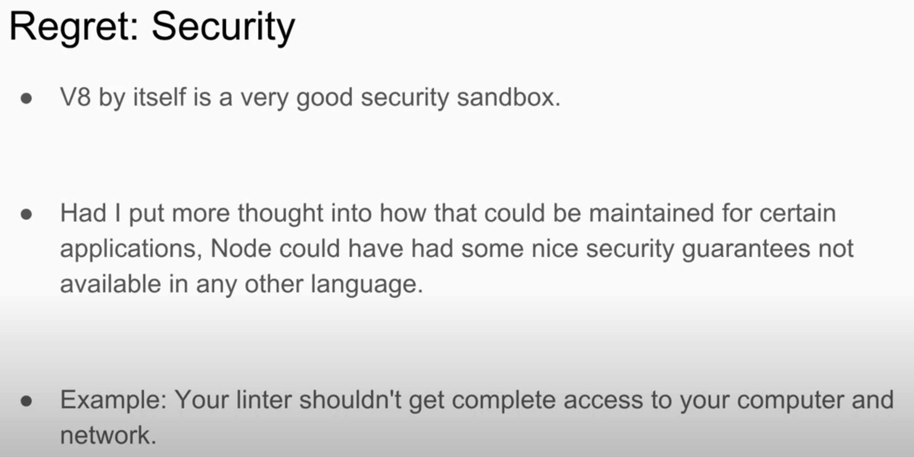
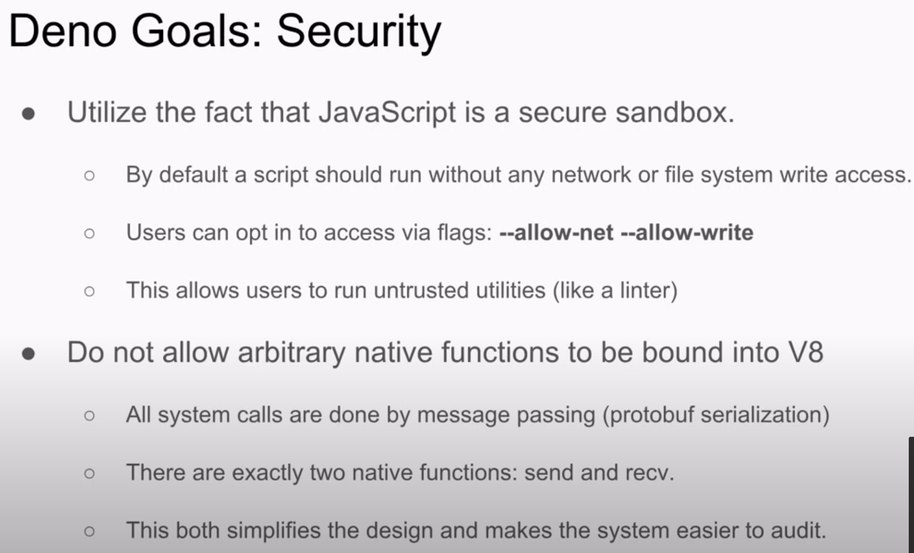

最近stackblitz 提的[WebContainers](https://blog.stackblitz.com/posts/introducing-webcontainers/) 着实在技术圈里火了一把，总结下来就是，这是一个在线的编辑器，WebContainers 技术可以做到在浏览器端执行node，可以直接利用Chrome DevTools调试，启动也比在本地快。stackblitz和code sandbox 这种编辑器的区别在于，stackblitz的代码执行全是离线的，而codesandbox则是将代码跑在一个remote server上然后将结果返回回来。<!-- more -->

stackblitz这个功能配合PWA，完全可以离线使用。可以用来学习各种前端框架，后端SSR框架，Node。看起来还是很不错的。

在stackblitz的博客中说到 它的一个特性是 “secure by default”。 因为代码的执行全是在浏览器的sandbox中，所以是更加安全的。看到这里，笔者就在思考语言的安全到底是什么意思？一般可以通过什么方式去是实现呢？

之后，想起ry 曾经的演讲 [我对Node.js遗憾的十件事](https://www.youtube.com/watch?v=M3BM9TB-8yA)

根据ry的说法，node可以随意调用system call，可以访问系统的文件，这在机器上可能会有 安全问题。你无法控制node不让其访问某些文件（这可以通过类似于docker这样的容器来实现隔离？）。ry在介绍deno的时候，谈到deno如何修复这个问题的

通过一些flag可以控制运行时的权限从而保证security。

另外，常常听到rust说自己是一门安全的语言，是不是也是想表达类似的意思呢？由于笔者在这方面没什么研究，所以这个问题就先搁置了。。
